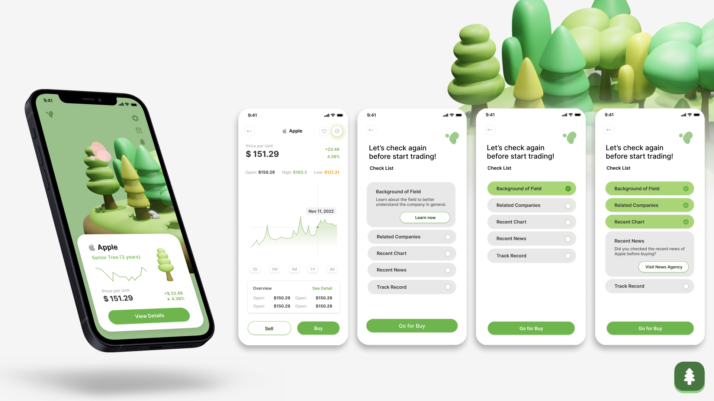
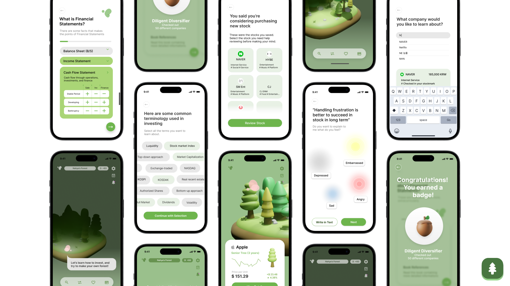
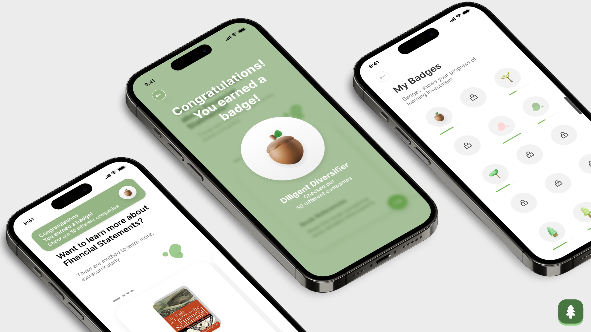

# Introduction

Evergrow is a FinTech app that empowers beginners to participate in stock management and investment, fostering self growth in their financial literacy. It achieves this through a unique representation of a user's portfolio as a forest, enhancing understanding of stocks and reducing frustration from direct exposure to price fluctuations. Over time, the trees representing stocks flourish with sustained investments, encouraging thoughtful decisions and a commitment to long-term investments. The app integrates Hazel, a financial fairy advisor, who provides insights on fiscal choices, cultivating a healthier investment atmosphere for newcomers.

# Problem Statement

<b>Investment is difficult to navigate and understand.</b>

From the stock beginners’ perspective, we wanted to establish a system where beginners can grow their ability in stock, learn the basic knowledge and skills on trading stock, but without being too stressed out. With Evergrow, we present an easy stock managing app that enables users to go through step-by-step learning guidance, get mental helath care support to manage stress, acquire healthy stock investment habit, and ask their personal assistant whenever they need to get help in the process.

# Research 

## Background Research

* <b> The less you research in stock before buying, the less possibility that you will make good decision</b> 
Expanding your perspective on stock can make your investment decisions better. Therefore, users should look more into new companies and fields when investing in stock.
    <i> - Kumar, A., & Lim, S. S. (2008). How Do Decision Frames Influence the Stock Investment Choices of Individual Investors?</i>

* <b>Stock investing without information can lead to unhealthy trading habit</b> 
A knowledgeable user is able to responsibly invest in stock. Stock investment without reasoning can lead to gambling and possible addiction.
“A basic knowledge of investment is very important to avoid irrational investment practices (gambling).”
     <i> - Widhar, Reza & Oktaviani, Indri. (2018). Determinants of Individual Investor Behaviour in Stock Investment Decisions</i>

## Survey and Interview

We conducted a survey and a follow-up interview with young investors aged 20 to 32 years old. We found that most participants engage in stock investment on less frequent basis and find it difficult to obtain informations, study related vocabulary. Participants are afraid to do stock, and often feel like their time is wasted.

# Persona

Based on the results, we drafted a vision of what a young, beginner invester looks like.
In a context of a busy, everyday life, stock investment is a side task that should not bring too much additional stress into young person's life.

# Defined Needs and Evergrow's Solution

Problems we want to solve through the service:
* How might we let users learn and acquire basic knowledge on stock market, but in a fun and easy way?
* Why do people feel frustrated when first learning stock, and how can we solve it? 
* How can we visualize stock in an appealing way, to keep users’ interest in stock?

## Difficulty in Acquiring Information

Users report difficulty in discerning what’s important from the flood of information. Yet it is unrealistic for beginners to look at every source before making investment decisions.

Evergrow’s 2-stage structure and guided research solves this problem. A ‘Learning Stage’ where users can establish sufficient understanding about the basics of stock trading is provided before the ‘Habitating Stage’ where users engage in actual trading activity. In Habitating Stage, suggestions on what information users should look out for helps make active informed decisions.

## Mental Exhaustion

On the survey our team carried out to 28 participants ranging from 20 to 26 years old, 68% reported to have a passive status toward stock investment. A major reason for this disengagement was emotional fatigue from being overly conscious on price fluctuation.

To prevent investors to going to extremes and giving up investing altogether from excessive stress, Evergrow provides mental care. This is done in the 2 tracks of helping users express negative feelings and relieve them, as well as looking back at past decisions and analyzing the mistakes.

## Lack of Sense of Growth/Achievement

Another major reason that users feel discouraged to continue investing is the lack of sense of growth or achievement. Evergrow replaces traditional stock portfolios into visual and emotionally engaging ones using the metaphor of growing a forest. This has the additional benefit of encouraging long-term investment, by reminding the investors their stocks have the potential to continuously grow and flourish.

# Applied Solution

To support the investment habits of users, we came up with a two-stage process for learning stock investment: learning and habitating, where users first learn about stock investment, and later grow their own forest stock. Throughout the process, we encourage long-term engagement and support them mentally with an interactive in-app guide, Hazel.  

# Vision

There are applications on the market that make it easy to get started in investment, but they lack a support system that keeps users engaged long term. Evergrow incorporates a calming visual of a user’s stock portfolio as a forest, applying gamification functions to a fintech app. Additionally, the app supports users in long term investment decisions through showing their stock tree’s growth over time and including a checklist of topics to check before buying stock. When users face financial loss, Evergrow offers various support to allow users to make their own steps towards financial literacy and growth in stock investment knowledge.

## Evergrow helps to build long term investment perspectives

Under the Sustainable Development Goals, Evergrow provides quality education by focusing on ensuring inclusive and accessible financial education on stocks and investments and promotes continuous learning opportunities for all. With the fairy assistant, Hazel, the app has built in learning topics targeted to the users’ interest and specific feedback to help users improve. Evergrow encourages beginners to continue advancing their knowledge and support them even as they face failure to illustrate the importance of failure for growth.

## Give a chance of intense learning for beginner

Inside the app, the user goes through two stages: learning and habituating. In the first stage, the user studies different topics, level by level, before entering the stock trading system. We encourage the user to build their confidence and grow first, then practice their knowledge on real market.

## Promote the mental health of the investors

As stock trading is very stressful for many young people, we recognize their need for support during their investment, especially when it is not going well. At any time the user can ask Hazel, the fairy assistant, for support in recognizing their emotions. We provide the user with a list of activities they can perform to relieve the stress or we help them rationally analyze their stock investment reasoning.

## Breaking the entry barrier to start investment

With such large volumes of information online, communities with various opinions, and high barriers of entry, it is difficult for beginners to get started in investing. Evergrow simplifies the google searches into specific topics to research and guides users to reliable resources and keywords. In the user interface design, the design elements were created with limited text to read easily, rounded shapes to appeal as friendly, and a visually engaging forest to simplify the user’s stock portfolio. Additionally, users can easily move forward in their investment journey with the help of Hazel, the fairy assistant, if they ever get stuck.

# UI design

# My Role / Contribution
My responsibility in the project included:
* Performing background research - finding related research papers
* Conducting survey study - organizing questions 
* Interview analysis - collecting pain points and needs

# About This Project

This project received [iF Design Award 2024](https://ifdesign.com/en/winner-ranking/project/evergrow-investment-education-service/618273).

This project was conducted as a part of User Experience (UX) class at ID KAIST, thanks to NH Investment & Securities. The project was a result of a team effort from Jaeryung Chung, Jamie Ashley Dee, Minseo Bang, Zofia Marciniak, Eunseo Oh, Hyeongjeong Im, Sunok Lee and Sangsu Lee. 

