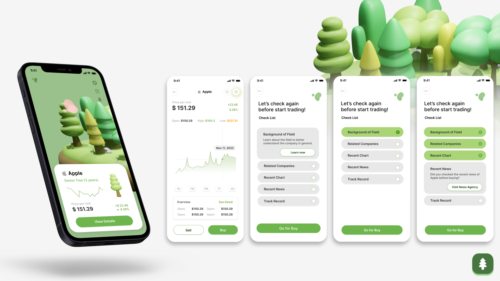
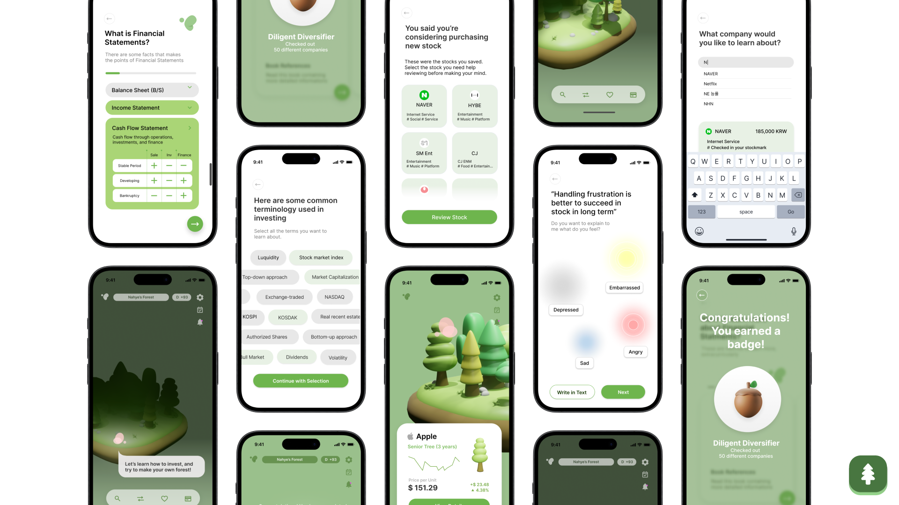
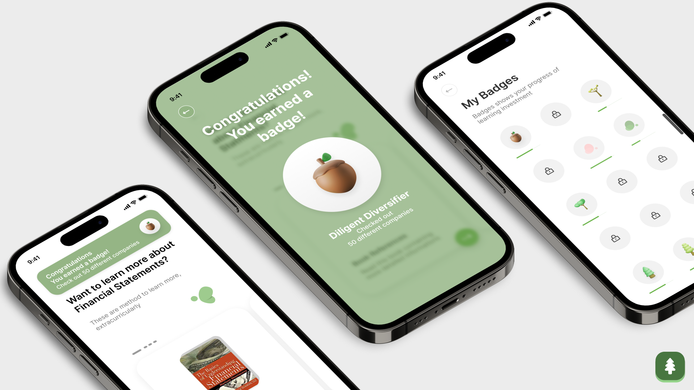
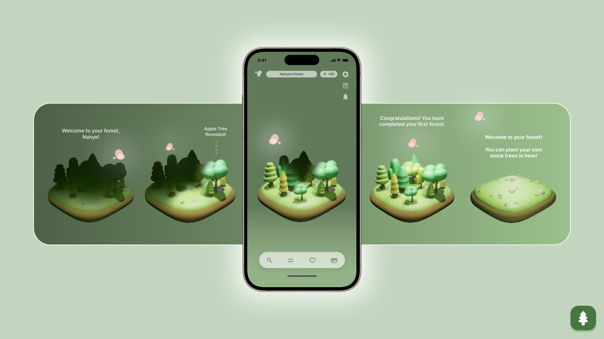

Evergrow is a FinTech app that empowers beginners to participate in stock management and investment, fostering self growth in their financial literacy. It achieves this through a unique representation of a user's portfolio as a forest, enhancing understanding of stocks and reducing frustration from direct exposure to price fluctuations. Over time, the trees representing stocks flourish with sustained investments, encouraging thoughtful decisions and a commitment to long-term investments. The app integrates Hazel, a financial fairy advisor, who provides insights on fiscal choices, cultivating a healthier investment atmosphere for newcomers.

This project received [iF Design Award 2024](https://ifdesign.com/en/winner-ranking/project/evergrow-investment-education-service/618273).

This project was conducted as a part of User Experience (UX) class at ID KAIST, thanks to NH Investment & Securities. The project was a result of a team effort from Jaeryung Chung, Jamie Ashley Dee, Minseo Bang, Zofia Marciniak, Eunseo Oh, Hyeongjeong Im, Sunok Lee and Sangsu Lee. 

