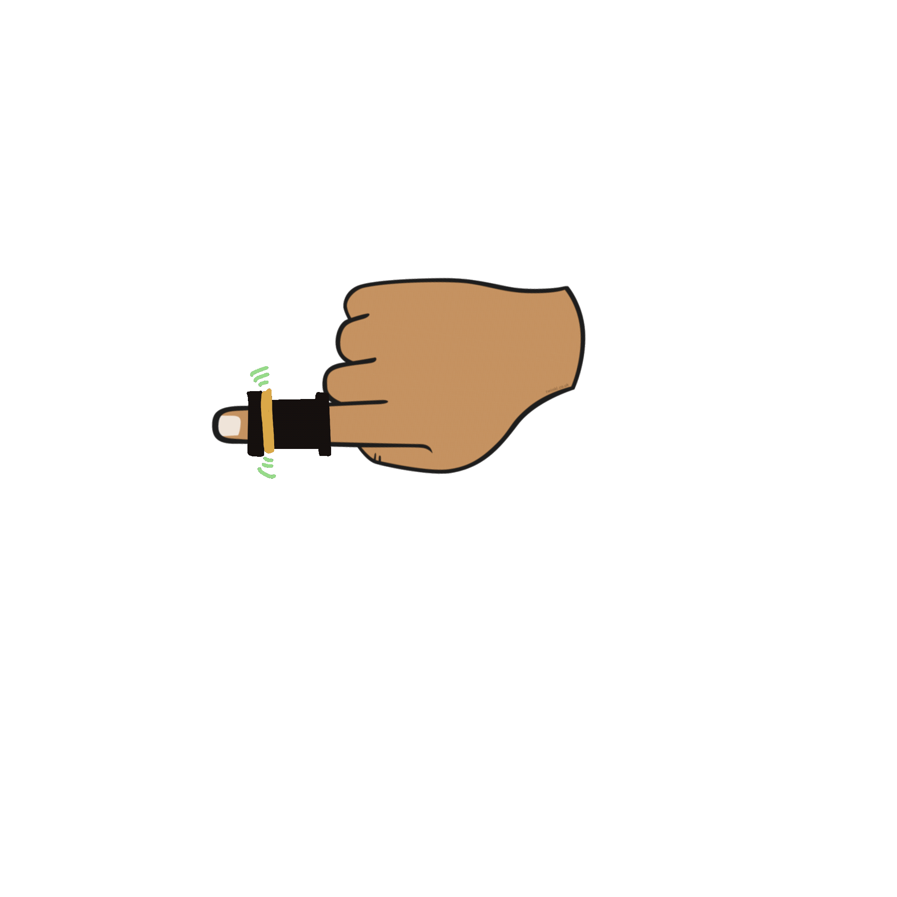

We introduce a novel wearable haptic feedback device that magnifies the visual experience of virtual and augmented environments through bidirectional vibrotactile feedback driven by electromagnetic coils with permanent magnets. This device creates guidance haptic effect through magnetic attraction and repulsion. Our proof-of-concept prototype enables haptic interaction through altering position of wearable structure, vibrating with different intensity, and waveform pattern. Example applications illustrate how the proposed system promotes guided and rich haptic feedback.

# Method
Device was made by wrapping copper wire around a 3D printed ring prototype. It creates feedback by interacting with permanent magnets. Evaluated on 4 different ring shapes (rectangle, square, round, oval)

# Result
Oval shape is optimal for strong interaction and smaller size. A haptic actuator offers with three interaction types: physical force feedback, moving patterns, and vibration.

# Application
Guiding user's physical movements during mobile device interaction; VR gaming enhancement; haptic feedback on gesture-based copying and pasting on mobile devices

<video src="images/video.mov" width="100%" height="100%" controls></video>
