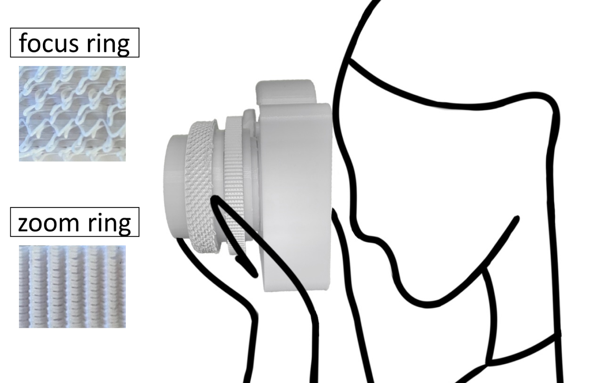
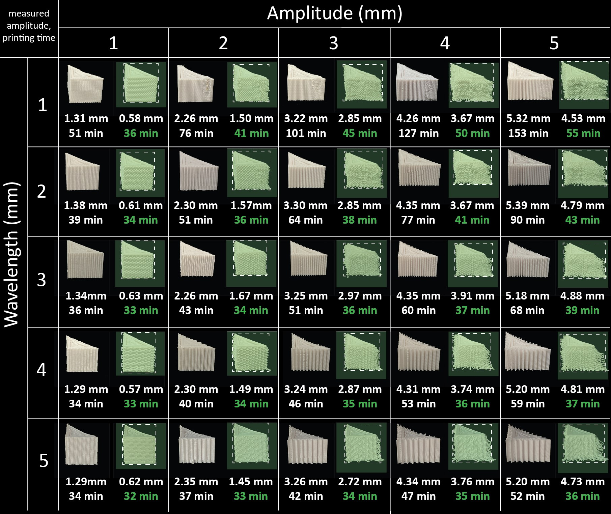
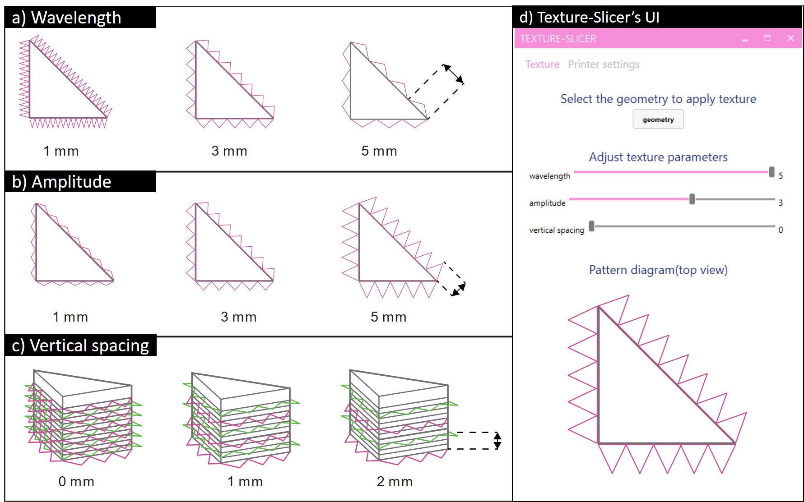
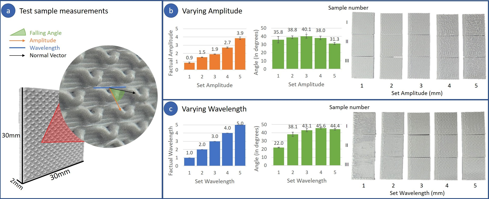

**Background**  Prior  methods  for  applying  auto-generated  textures  on  a  3D  model  involve  the  construction of geometric feature layers on the top of the model surface. These geometries form a textural pattern that is effectively fused and inseparable from the underlying object. However, this interconnection makes it challenging to facilitate follow-up adjustments of the 3D model during the design process without necessitating the remodeling of parts, leading to a cumbersome process for designers and engineers.

**Methods**  In this paper, we present Texture-Slicer , an innovative approach that addresses this issue by  applying  the  texture  patterns  not  during  modeling,  but  instead  during  the  slicing  process  conducted  before 3D printing. This means that the 3D model remains unchanged and that a tunable texture pattern is  achieved  by  injecting  modifications  of  the  G-code  just  before  the  printing  process.  Furthermore,  Texture-Slicer   allows  users  to  control  the  level  of  roughness  with  the  texture  parameters  (wavelength,  amplitude,  and  vertical  spacing),  supporting  the  creation  of  numerous  custom  textures  for  the  same  underlying geometry.  

**Results**  Technical  evaluation  of  paradigms  was  conducted  with  30  test  samples.  Then,  a  total  of  59 texture samples were successfully printed, and an investigation of roughness perception was conducted through a preliminary user study involving 6 participants who evaluated 50 printed samples. The findings indicate that increased wavelength and amplitude created more roughly perceived textures. With vertical spacing,  wavelength  did  not  affect  the  perceived  roughness  of  the  texture,  while  amplitude  did  affect.  Moreover, we presented practical applications that exemplify how Texture-Slicer  can be used by designers to generate diverse textures for identical objects to achieve different aesthetic or functional purposes.  

**Conclusions** Texture-Slicer   allows  designers  to  achieve  rapid  iterations  and  seamless  texture  modifications on objects without the necessity of remodeling the underlying 3D model. while enabling the encoding of various properties, such as tactile or mechanical attributes into products, all without altering the target 3D model’s surface.